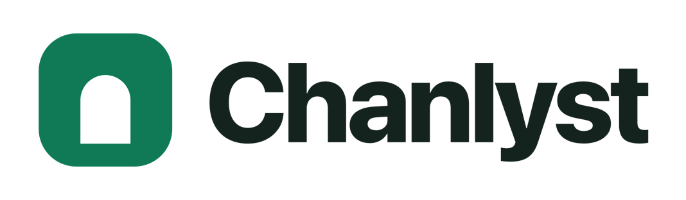
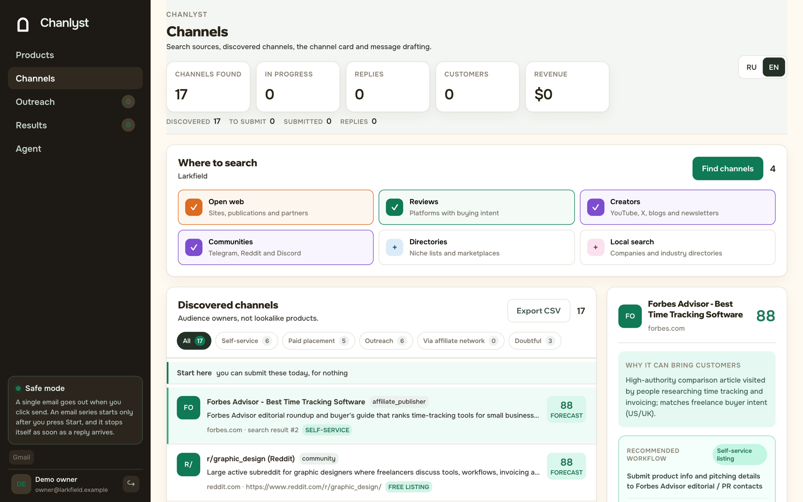
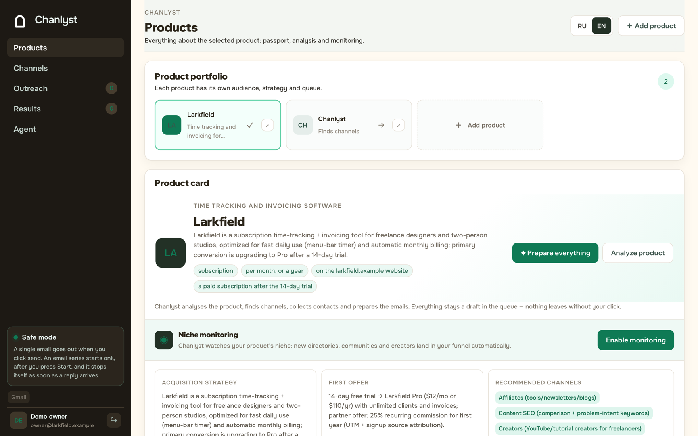

<div align="center">

<picture>
  <source media="(prefers-color-scheme: dark)" srcset="docs/brand/logo-dark.png">
  
</picture>

<br><br>

[](LICENSE)
[](#run-it)
[](tests)

### Find the places your paying customers already are — not the people.

**Chanlyst**: an alternative to buying a lead list, and to the afternoon you
would spend on Google finding the same ten directories everyone else found.

Give it a product URL. It works out who pays for that kind of thing, then
searches the open web for the directories, communities, newsletters, creators,
partners and marketplaces that already hold that audience — and tells you, for
each one, whether the way in is a form, a paid slot, or a message to a human.

[chanlyst.com](https://chanlyst.com) · [Run it yourself](#run-it) · [What a run costs](#what-it-costs-to-run) · [Contributing](CONTRIBUTING.md) · [Security](SECURITY.md)

</div>

<!-- An inline player needs a github.com/user-attachments URL, which only comes
     from uploading the file through GitHub's own UI. A <video> tag pointing at
     raw.githubusercontent is stripped by the markdown sanitiser, and the file
     is served as application/octet-stream with nosniff, so a browser would
     download it rather than play it. Measured, not assumed. -->

**[▶ Watch the 71-second walkthrough](docs/chanlyst-walkthrough.mp4)** — no sound needed.



---

## What it does

- **Reads the product, not just the keyword.** Audience, commercial model, what
  counts as a paid conversion — and it writes the search queries this
  particular product needs, not a template.
- **Searches eight ways at once**, two pages deep, and a later run rotates to
  the next set of queries and starts further down the results. Asking the first
  run's questions gets you the first run's answers.
- **Says why each channel was kept**, what to do about it, and what it will
  probably be worth — grouped into what you can submit today for nothing, what
  costs money, and what needs a human.
- **Reads every candidate's own page** and judges it against your product.
  Anything live and real but aimed elsewhere is grouped off, never deleted: a
  wrong rejection is expensive and invisible.
- **Finds a public contact** on the site's own pages and checks it there.
- **Drafts the message**, queues it, and sends nothing until you press send.
- **Shows where a competitor is listed and you are not**, by asking each channel
  about them rather than asking the web where they are.
- **Tracks what happened**: submitted, live, replied, meeting, paying.

## What it is not

- **Not a scraper of people.** It looks for places. The only addresses it
  collects are the ones a site publishes on its own contact page.
- **Not an account driver.** Nothing logs into your accounts from a cloud proxy
  or a headless browser, which is the behaviour platforms ban. E-mail leaves
  from your own connected Gmail, on your click.
- **Not a bulk sender.** One message goes out per press. A sequence starts only
  after you start it, and stops itself the moment a reply arrives.

---

## Run it

```bash
git clone https://github.com/chanlyst/chanlyst.git
cd chanlyst
cp .env.example .env     # put your OpenRouter key in it
docker compose up
```

Then open <http://localhost:3000>.

You need a password hash for the owner login before you can sign in:

```bash
node scripts/hash-password.mjs 'your password'
```

Paste the output into `OWNER_PASSWORD_HASH` in `.env`, alongside an
`OWNER_LOGIN` of your choosing.

Everything else — Gmail sending, e-mail sign-in links, billing — is optional and
off until you configure it. `.env.example` explains each one where it stands.

`SELF_HOST=1` is already set there. It removes the plan quotas, which exist to
price the hosted service and mean nothing on a server where the API calls are
billed to you. The subscription section hides itself whenever no payment
provider is configured.

---

## What it costs to run

Two keys carry the whole product.

| | | |
|---|---|---|
| **OpenRouter** | required | Analyses the product, judges every candidate, writes the outreach. |
| **Serper** | strongly recommended | Google results. 2,500 free queries, then $0.30 per 1,000. |

Serper is optional in the sense that the app starts without it, and a bad idea
in every other sense. Measured on this codebase: a broad discovery run costs
about **$0.05** with Serper and about **$1.17** without — twenty-three times
more. Without it the model searches on its own, and every page it pulls arrives
as input tokens at the expensive model's rate. Telegram channel discovery,
contact-page lookup and the competitor gap need it outright.

---

## How a run works

One press of **Prepare everything** walks a product through five steps, each
resumable, each visible while it runs:

1. **Analyse** — audience, commercial model, which acquisition motions fit, and
   the search queries this product needs.
2. **Discover** — eight specialised lanes in parallel, two SERP pages deep.
3. **Expand** — direct buyers, as a separate bounded search.
4. **Enrich** — contact pages, read and checked against the site itself.
5. **Draft** — a message per channel that needs one, queued and unsent.



Both screenshots are a real run against a made-up product — a time-tracking app
for freelance designers — so the channels in them are the ones Chanlyst actually
returned for it: a Forbes Advisor roundup, r/graphic_design, design podcasts, a
Zapier comparison post. Nothing is staged.

---

## Stack

TypeScript, React 19, Next.js 16 on [vinext](https://github.com/cloudflare/vinext)
and Vite. It runs on the Cloudflare Workers runtime, with SQLite (Cloudflare D1)
underneath and Drizzle for the schema. The Docker image exists because "clone it
and work out the Workers runtime" would lose most readers on the first evening.

```bash
npm test     # typecheck, production build, and 439 tests — no network, no keys
```

[docs/ARCHITECTURE.md](docs/ARCHITECTURE.md) has the data model and how the
pieces fit.

---

## Licence

[AGPL-3.0](LICENSE). Use it, change it, run it for yourself or your clients. If
you run a modified version as a network service, the licence asks you to publish
your changes.

The hosted service at [chanlyst.com](https://chanlyst.com) is the same code with
the servers, the keys and the support attached, for people who would rather not
run it.
